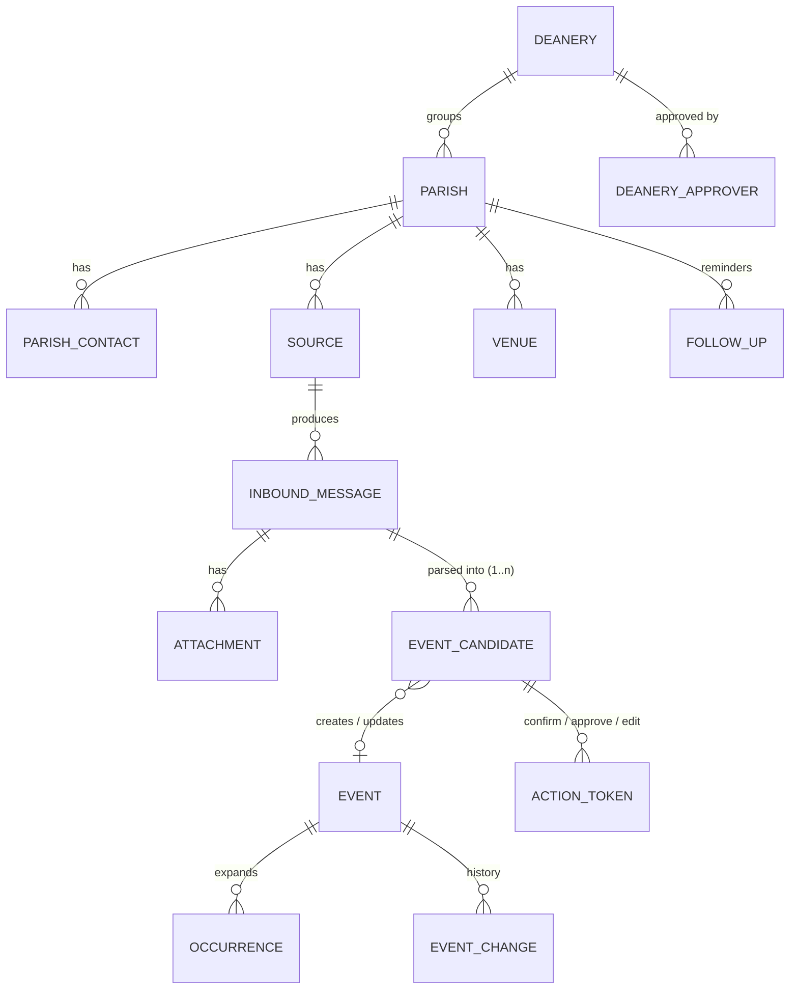
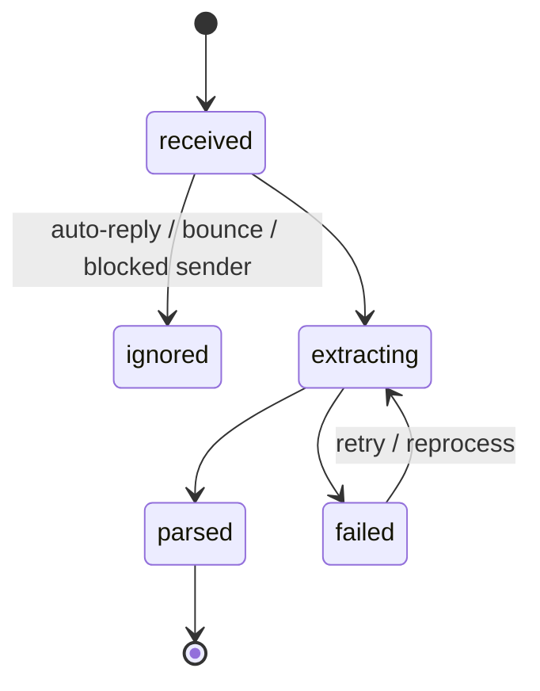
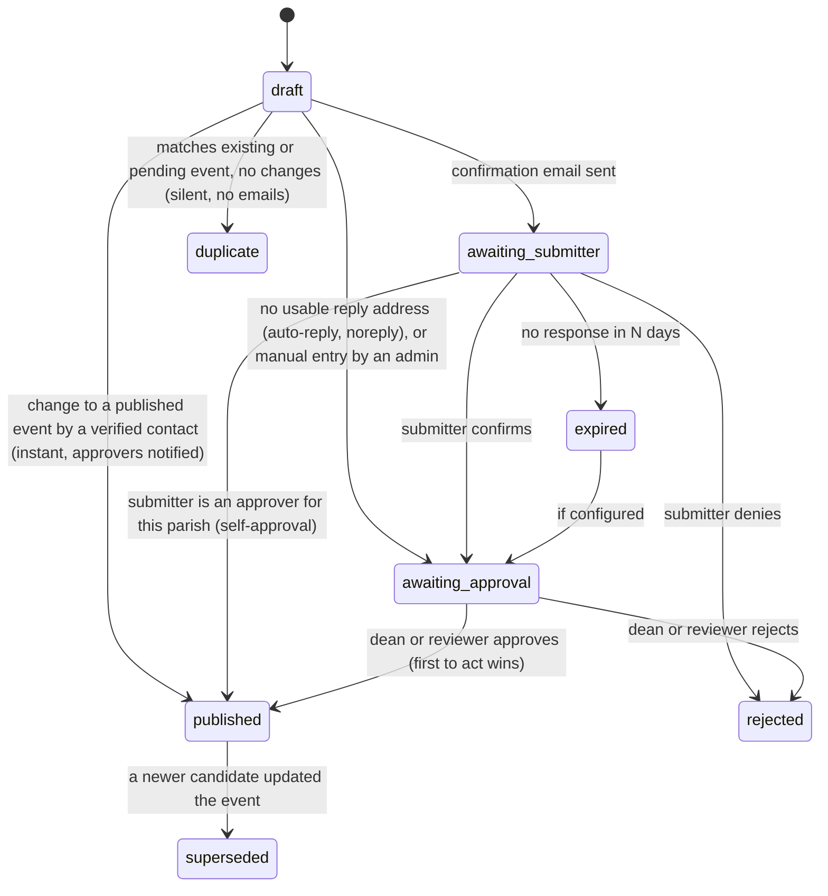

# Data model

All custom tables live in the **site's existing WordPress database** (MySQL; on xneelo this is MariaDB 10.11, a MySQL-compatible server). No separate database is needed. SQL must work on both MySQL 8 and MariaDB 10.11: no engine-specific features, and JSON is stored in `longtext`. Tables use the WordPress table prefix (shown as `wp_` here) and the `adct_pi_` namespace. Every table has `created_at` / `updated_at` (UTC). Local-time values are stored with the timezone `Africa/Johannesburg`. Schema changes go through versioned migrations (a `adct_pi_db_version` option plus `dbDelta`).

The prototype table `wp_adct_parish_intake_items` is replaced. Its rows can be migrated into `inbound_messages` + `event_candidates`, or dropped if they are only test data.

## Entity overview

## Tables

### `adct_pi_deaneries`
| Column | Notes |
|---|---|
| id | PK |
| name, slug | e.g. "Central Deanery" |
| dean_name, vice_dean_name, secretary_name | display only; approval rights come from `deanery_approvers` |
| status | `active`, `inactive` |

The 8 official deaneries are seeded from [`data/seed/deaneries.csv`](../data/seed/README.md). A deanery with **no active approver** still works: its items go to archdiocese reviewers only ([ADR 0008](decisions/0008-approval-by-dean-or-archdiocese-reviewer.md), point 7).

### `adct_pi_deanery_approvers`
| Column | Notes |
|---|---|
| id | PK |
| deanery_id | FK |
| wp_user_id | WordPress user with the `deanery_approver` role |
| email | where approval emails go |
| label | e.g. "Dean", "Assistant" |
| notify_mode | `each` (email per item, default) or `digest` (daily) |
| reminders_enabled | bool |
| active | bool; a deanery can have several active approvers |

Archdiocese reviewers aren't listed here. They are WordPress users with the `adct_pi_review` capability and approve anything.

### `adct_pi_parishes`
| Column | Notes |
|---|---|
| id | PK |
| name, slug | e.g. "Woodstock: St Mary's" (the directory uses "Area: Church") |
| area, church | e.g. "Woodstock", "St Mary's"; the parser matches both |
| kind | `parish`, `outstation`, `mass_centre`, `group`, `archdiocese`, `school`, `other` |
| parent_parish_id | FK → parishes; set for outstations, mass centres and parishes administered by another parish. Contacts of the parent parish may submit for them. |
| deanery_id | FK → deaneries; null for groups/offices without a deanery (their events go to archdiocese reviewers only) |
| address, suburb | |
| latitude, longitude | decimal(9,6); used for "near me" |
| website, phone | |
| official_source_id | FK → sources; the channel whose content is trusted |
| expected_cadence_days | e.g. 30; null = no expectation |
| reminders_enabled | per-parish on/off (a global switch also exists) |
| status | `active`, `inactive` |
| notes | admin notes |

The 124 parishes, outstations and mass centres are seeded from [`data/seed/parishes.csv`](../data/seed/README.md) (public directory data; only official `@adct.org.za` office emails, which become `verified` contacts on import).

### `adct_pi_venues`
Named places for a parish (church, hall, outstation), each with its own address and lat/lng. Used by the parser to look up venue names.

### `adct_pi_parish_contacts` (sender registry)
| Column | Notes |
|---|---|
| id | PK |
| parish_id | FK (a contact can be linked to several parishes via repeated rows) |
| email | lower-cased, unique per parish |
| display_name, role_label | e.g. "Fr John", "Secretary", "Office" |
| trust | `unknown`, `pending`, `verified`, `blocked` |
| verified_at | set when the contact confirms via token or an admin links them |
| wp_user_id | set when a portal account exists |
| last_seen_at | last message received from this address |
| receives_reminders | bool |

Learning rule: when an unknown address submits, a `pending` row is created with a best-guess parish (from the parser/gazetteer). An approver or admin confirms the link, and the contact becomes `verified`. Being verified fills in parish/venue automatically and lets the contact change published events instantly. It does **not** skip approval for new events ([ADR 0008](decisions/0008-approval-by-dean-or-archdiocese-reviewer.md)).

### `adct_pi_sources`
| Column | Notes |
|---|---|
| id | PK |
| parish_id | nullable (archdiocese-wide sources) |
| type | `email`, `ics`, `pdf_url`, `facebook_page`, `whatsapp_forward`, `rss`, `web_page`, `manual` |
| identifier | mailbox address, URL, page id… |
| role | `official` or `monitored` |
| status | `active`, `paused`, `unreliable`, `disabled` |
| poll_interval_minutes | |
| checkpoint | JSON (e.g. IMAP UIDVALIDITY + last UID, ICS ETag, last post id) |
| last_checked_at, last_success_at, last_item_at | health tracking |
| consecutive_failures, last_error | |

### `adct_pi_inbound_messages`
| Column | Notes |
|---|---|
| id | PK |
| source_id | FK |
| external_id | e.g. `Message-ID` header; unique with source_id → prevents duplicates |
| content_hash | sha256 of normalised body; catches re-sends with a new Message-ID |
| sender_email, sender_name, subject | |
| received_at | |
| raw_path | path to stored raw `.eml` (not in DB, to save space) |
| body_text | extracted plain text |
| auth_results | JSON: SPF/DKIM/DMARC verdicts |
| is_auto_reply | bool; auto-replies never get confirmations |
| status | see state machine |
| error | |
| retention_until | raw data deleted after this date |

### `adct_pi_attachments`
message_id, filename, mime_type, size_bytes, storage_path, content_hash, `extracted_text`, `extraction_method` (`pdf_text`, `ocr_external`, `ai_vision`, `manual`, `none`), status.

### `adct_pi_event_candidates`
| Column | Notes |
|---|---|
| id | PK |
| message_id | FK (nullable for manual/portal entries) |
| block_index | position in the message (a bulletin can yield several candidates) |
| parish_id | best guess or known |
| fields | JSON: title, description, start, end, all_day, venue_id / venue_text, contact, event_type, featured, image attachment id |
| recurrence | JSON: RRULE parts + human text + `ambiguous` flag |
| confidence | 0–1 |
| parser_version, strategies, notes | provenance |
| ai_used, ai_provider, ai_model | provenance |
| match_event_id, match_kind | `new`, `update`, `duplicate`, `cancellation` |
| status | see state machine |
| confirmed_by, confirmed_at | submitter confirmation (email or user) |
| approved_by, approved_at | approver (user id or email) |
| approved_via | `dean`, `reviewer`, `self`, `contact_change` (instant change to a published event) |
| decided_by, decided_at, decision_note | audit (reject/other decisions) |

The rule parser represents the start as `event_date` / `event_time` and only adds `event_end_date` / `event_end_time` when it finds a date or time range. Single dates and times omit the end fields. If a range's end is before its start, the parser adds a note and lowers confidence rather than silently reordering it.

### `adct_event` (WordPress custom post type)
Post title/content hold the public text. Post meta holds: `parish_id`, `venue_id`, `start_local`, `end_local`, `all_day`, `rrule`, `exdates` (JSON), `rdates`, `featured`, `status_flag` (`scheduled`, `cancelled`, `postponed`), `source_candidate_id`, `contact`. Taxonomy: `adct_event_type`.

A post type (rather than only custom tables) gives WordPress revisions, search, REST, theme templates and editor familiarity for admins.

### `adct_pi_occurrences`
event_id, start_utc, end_utc, start_local_date, parish_id, event_type_term_id, latitude, longitude, is_cancelled. It is rebuilt for an event whenever the event is saved, and refreshed daily for a rolling 12-month window. All public listing queries read from this table.

### `adct_pi_event_changes`
event_id, candidate_id (nullable), actor (user id / email), kind (`update`, `cancel`, `postpone`, `revert`, `unpublish`), before JSON, after JSON, notified_at, reverted_by, reverted_at. Every change to a published event is written here, so approvers can see what changed and **revert with one click** ([ADR 0008](decisions/0008-approval-by-dean-or-archdiocese-reviewer.md)).

### `adct_pi_action_tokens`
token_hash, purpose (`confirm`, `deny`, `edit`, `login`, `publish_found`, `approve_event`, `reject_event`, `revert_change`), subject_type/subject_id, email, expires_at, used_at, created_ip.

### `adct_pi_follow_ups`
parish_id, kind (`inactivity_reminder`, `found_on_secondary`, `unknown_sender`, `approval_reminder`), channel, sent_at, outcome, note.

### `adct_pi_mail_queue`
recipient, subject, body_html, body_text, priority (1 = login/confirmation, 2 = approver/change notice, 3 = reminder/digest), group_key (to bundle notices per approver), status (`queued`, `sent`, `failed`, `suppressed`), attempts, next_attempt_at, sent_at, error. The sender respects an hourly cap (default 100) because the host allows 500 emails per hour for the whole account ([ADR 0011](decisions/0011-outbound-email-queue-with-hourly-cap.md)). Sent rows are pruned after 30 days.

### `adct_pi_audit_log`
actor (user id / email / `system`), action, subject_type, subject_id, details JSON, created_at.

## State machines

### Inbound message

### Event candidate

`awaiting_approval` items appear in the queue of every active approver of the parish's deanery **and** in the archdiocese reviewers' queue. The move out of `awaiting_approval` is a single conditional update (`… SET status = 'published' WHERE id = ? AND status = 'awaiting_approval'`), so only the first approver's action takes effect. Later clicks show "already decided by …".

### Published event
`scheduled` → `cancelled` / `postponed` (still visible, clearly marked) → the event is trashed only by an admin. Past events stay visible in an archive view.

## Retention (POPIA)

- Raw `.eml` files and attachments: default **12 months** after receipt (configurable), then deleted. Extracted candidates and published events stay.
- Action tokens: deleted 30 days after expiry.
- Bulletin sections with personal information (Mass intentions, sick lists, finances) are skipped by the parser and never copied into candidates, events or AI prompts ([E3.7](https://github.com/Archdiocese-of-Cape-Town/adct.org.za/issues/74)).
- Event change history (`event_changes`): kept while the event exists, then deleted with it.
- Audit log: 24 months.
- Outgoing emails show the archdiocese's contact details for questions about personal information.
