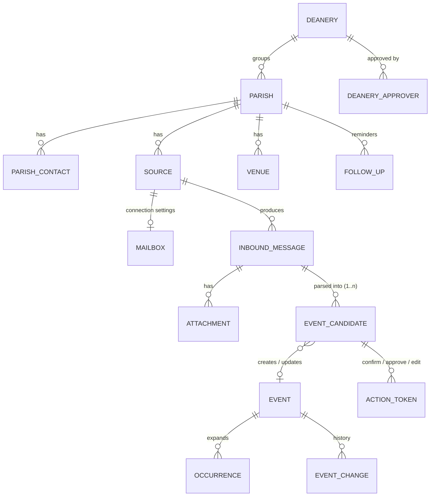
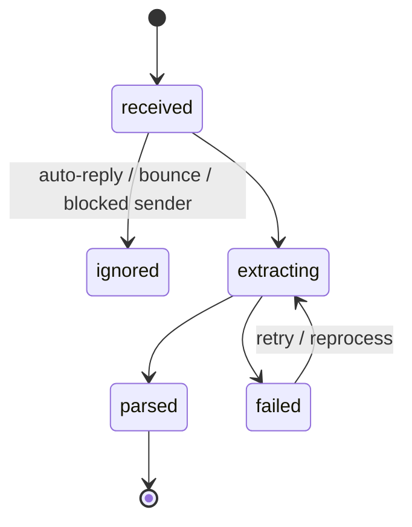
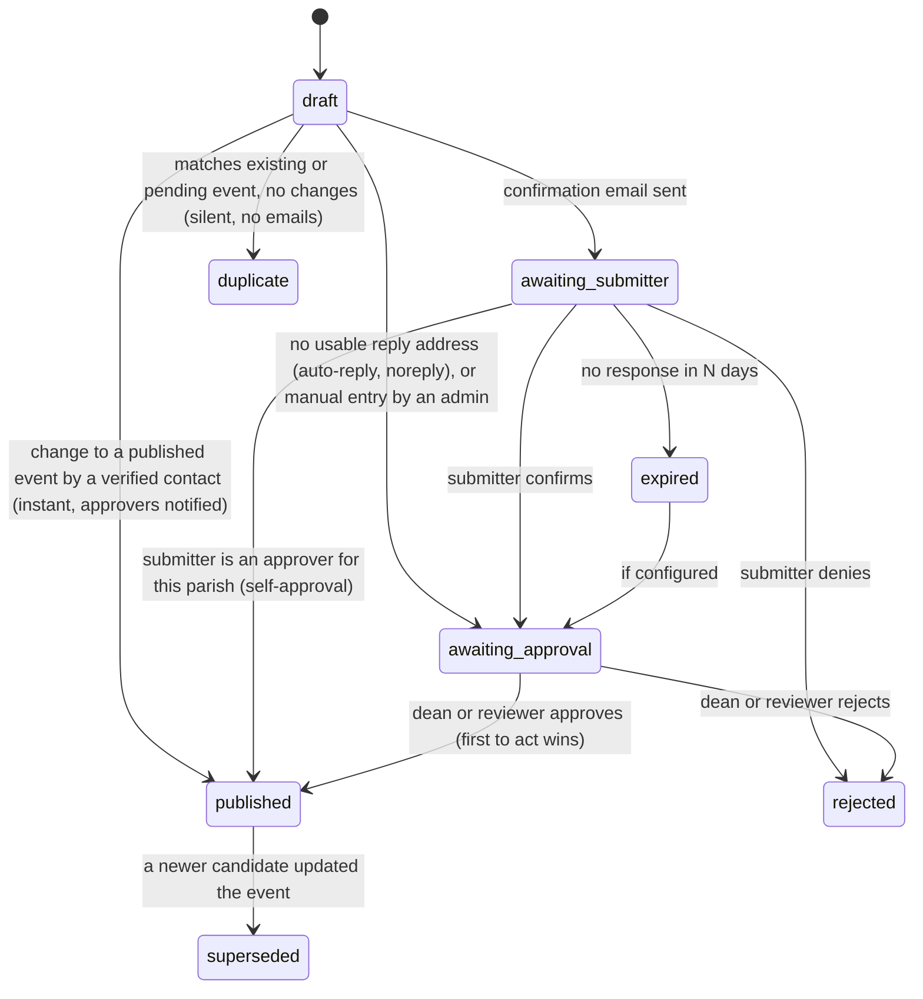

# Data model

All custom tables live in the **site's existing WordPress database** (MySQL; on xneelo this is MariaDB 10.11, a MySQL-compatible server). No separate database is needed. SQL must work on both MySQL 8 and MariaDB 10.11: no engine-specific features, and JSON is stored in `longtext`. Tables use the WordPress table prefix (shown as `wp_` here) and the `adct_pi_` namespace. Every table has an auto-incrementing `bigint(20) unsigned` `id` and UTC `created_at` / `updated_at` columns. Local-time values are stored with the timezone `Africa/Johannesburg`. Schema changes go through ordered, versioned migrations (`adct_pi_db_version` plus `dbDelta` for table definitions); the v4 nullability change uses a checked, idempotent `ALTER TABLE` through the database adapter. Scheduled-job checkpoints, locks, and run history are stored in non-autoloaded WordPress options and do not add custom tables.

**Current schema version: 6.** Version 1 creates the 15 `adct_pi_*` tables listed below; version 2 extends `adct_pi_venues` without changing that table count; version 3 adds `adct_pi_mailboxes` for 16 tables total; version 4 makes `adct_pi_occurrences.parish_id` nullable so archdiocese-wide events do not use a fake parish ID; version 5 adds the unique `(recipient, group_key)` mail queue index; and version 6 adds the action-token rate-limit table for 17 tables total. Fresh installs create the nullable occurrence column and unique mail index in the canonical schema. Upgrades verify the mail index and add it only when absent; duplicate non-NULL recipient/key pairs block v5 with an explicit error and no rows are removed. `adct_event` remains a WordPress custom post type and is not a custom table migration. Schema v1 stores JSON in `longtext`, booleans in `tinyint(1)`, and uses indexed `varchar` columns no longer than 191 characters for utf8mb4 key limits. The composite mail queue index is 1,528 bytes at utf8mb4 (191 characters × 4 bytes × 2 columns), within the 3,072-byte InnoDB index limit for MySQL 8 and MariaDB 10.11. Relationships shown as foreign keys below are logical references; physical foreign-key constraints are intentionally not used so schema upgrades work on both supported database servers. For columns whose prose description did not specify storage types, v1 uses unsigned `bigint(20)` for WordPress and relationship IDs, `datetime` for UTC instants, and `date` for `occurrences.start_local_date`; enum-like values use `varchar` rather than database `ENUM`. `attachments.size_bytes` is unsigned `bigint(20)`, and `event_candidates.confidence` is `decimal(4,3)`. `mail_queue.subject` is `varchar(255)`, action-token `created_ip` is `varchar(45)`, and event-change snapshots use `before_payload` / `after_payload` `longtext` columns.

The prototype table `wp_adct_parish_intake_items` is retained as a legacy table. Versioned migrations neither alter, drop, nor migrate it; the current Manual parser and static report continue using it unchanged. Its future disposition is pending an explicit owner decision: migrate its rows into `inbound_messages` + `event_candidates`, or drop it only after explicit admin confirmation. It must never be dropped silently.

## Entity overview

## Tables

### `adct_pi_deaneries`
| Column | Notes |
|---|---|
| id | PK |
| name, slug | e.g. "Central Deanery" |
| dean_name, vice_dean_name, secretary_name | display only; approval rights come from `deanery_approvers` |
| status | `active`, `inactive` |

The 8 official deaneries are seeded from [`data/seed/deaneries.csv`](../data/seed/README.md). A deanery with **no active approver** still works: its items go to archdiocese reviewers only ([ADR 0008](decisions/0008-approval-by-dean-or-archdiocese-reviewer.md), point 7).

### `adct_pi_deanery_approvers`
| Column | Notes |
|---|---|
| id | PK |
| deanery_id | FK |
| wp_user_id | WordPress user with the `deanery_approver` role |
| email | where approval emails go |
| label | e.g. "Dean", "Assistant" |
| notify_mode | `each` (email per item, default) or `digest` (daily) |
| reminders_enabled | bool |
| active | bool; a deanery can have several active approvers |

Archdiocese reviewers aren't listed here. They are WordPress users with the `adct_pi_review` capability and approve anything.

The approval-route resolver reads a parish, its deanery status and all of its approver assignments in one repository call. It routes only active assignments in an active deanery; a missing deanery, inactive deanery or deanery with no active approver returns an empty approver list and sends the item to archdiocese reviewers only. Deactivating an approver preserves its row for later reactivation.

Approver WordPress accounts are created with a random password and no notification email. Assigning an existing user adds the `deanery_approver` role without replacing other roles. The role is removed only after the user has no active approver assignments in any deanery.

### `adct_pi_parishes`
| Column | Notes |
|---|---|
| id | PK |
| name, slug | e.g. "Woodstock: St Mary's" (the directory uses "Area: Church") |
| area, church | e.g. "Woodstock", "St Mary's"; the parser matches both |
| kind | `parish`, `outstation`, `mass_centre`, `group`, `archdiocese`, `school`, `other` |
| parent_parish_id | FK → parishes; set for outstations, mass centres and parishes administered by another parish. Contacts of the parent parish may submit for them. |
| deanery_id | FK → deaneries; null for groups/offices without a deanery (their events go to archdiocese reviewers only) |
| address, suburb | |
| latitude, longitude | decimal(9,6); used for "near me" |
| website, phone | |
| official_source_id | FK → sources; the parish's current official source (kept in sync with `sources.role`) |
| expected_cadence_days | e.g. 30; null = no expectation |
| reminders_enabled | per-parish on/off (a global switch also exists) |
| status | `active`, `inactive` |
| notes | admin notes |

The 124 parishes, outstations and mass centres are seeded from [`data/seed/parishes.csv`](../data/seed/README.md) (public directory data; only official `@adct.org.za` office emails, which become `verified` contacts on import).

### `adct_pi_venues`
| Column | Notes |
|---|---|
| parish_id | FK → the parish that owns this venue |
| source_parish_id | nullable unique FK → an imported outstation or mass-centre parish; supports idempotent directory imports |
| name, aliases | aliases are a JSON list in `longtext`; each can also be entered as a comma-separated or newline-separated value |
| address, suburb | the venue's own location description |
| latitude, longitude | optional `decimal(9,6)` coordinates |
| is_default | bool; one active default per parish whenever it has active venues |
| status | `active`, `inactive`; inactive venues are not lookup candidates |

Selecting a default clears the flag from the parish's other venues. Deactivating a default promotes another active venue; the final active venue cannot be deactivated. Names and aliases are matched case- and punctuation-insensitively, treating `St`/`Saint`, apostrophe variants, and trailing `Church`/`Hall` as equivalent for lookup. Imports create a provisional default from the parish church/name when needed and create a parent-parish venue for linked outstations and mass centres without changing their child-parish records. Automatically generated defaults should be reviewed by an operator.

### `adct_pi_parish_contacts` (sender registry)
| Column | Notes |
|---|---|
| id | PK |
| parish_id | FK (a contact can be linked to several parishes via repeated rows) |
| email | normalised to lower-case, unique per parish |
| display_name, role_label | e.g. "Fr John", "Secretary", "Office" |
| trust | `unknown`, `pending`, `verified`, `blocked` |
| verified_at | set when the contact confirms via token or an admin links them |
| wp_user_id | set when a portal account exists |
| last_seen_at | last message received from this address |
| receives_reminders | bool |

Trust belongs to the **normalised email address**, not an individual parish link. The schema represents an address linked to several parishes as one row per `(parish_id, email)`; the Core contact service keeps `trust` and `verified_at` consistent across every row for that address. Blocking an address therefore blocks it at every linked parish, and verifying it verifies every link.

Learning rule: when an unknown address submits, a `pending` row is created with a best-guess parish (from the parser/gazetteer). An approver or admin confirms the link, and the contact becomes `verified`. Being verified fills in parish/venue automatically and lets the contact change published events instantly. It does **not** skip approval for new events ([ADR 0008](decisions/0008-approval-by-dean-or-archdiocese-reviewer.md)). A blocked address can return only to `unknown` through an explicit admin unblock; it must be verified again before it becomes trusted.

### `adct_pi_sources`
| Column | Notes |
|---|---|
| id | PK |
| parish_id | nullable (archdiocese-wide sources) |
| type | `email`, `ics`, `pdf_url`, `facebook_page`, `whatsapp_forward`, `rss`, `web_page`, `manual` |
| identifier | normalised email address for `email`; HTTP(S) URL for `ics`, `pdf_url`, `facebook_page`, `rss` and `web_page`; free label for `whatsapp_forward` and `manual` |
| role | `official` or `monitored` |
| status | `active`, `paused`, `unreliable`, `disabled` |
| poll_interval_minutes | at least 10 for pollable types; defaults to 1,440 (24 hours). `manual` sources are not polled and store NULL. These limits are provisional. |
| checkpoint | JSON (e.g. `{"uidvalidity":12345,"last_uid":67,"scan_complete":false}` for mailbox polling; also available for ICS ETag or last post id) |
| last_checked_at, last_success_at, last_item_at | health tracking |
| consecutive_failures, last_error | |

The mailbox poller checks `last_checked_at` against the source's `poll_interval_minutes`. `scan_complete` remains false until a full UID scan finds no further unattempted messages. With no consecutive failures, an incomplete checkpoint resumes immediately even if the configured interval has not elapsed; old mailbox checkpoints without this field are treated as incomplete once so an interrupted scan is not delayed. Failed checks use a provisional retry delay of 10 minutes, doubled for each consecutive failure and capped at 6 hours, measured from `last_checked_at` instead of the regular source interval.

The source registry already exists in schema v1, so source management does not need a schema migration. Parish-scoped `(parish_id, type, identifier)` values are unique. Saving an official parish source locks the parish row, demotes its previous official source to `monitored`, then updates `parishes.official_source_id` in the same transaction. A parish can have no official source until one is selected; at most one is official at a time. Archdiocese-wide sources (`parish_id IS NULL`) may have multiple official sources, including multiple sources of the same type (provisional; there is no cross-source uniqueness rule).

Source health is changed only by the Core `SourceHealthRecorder`, not by the admin form. A success updates check/success times, resets failures and clears the last error; its item time changes only when a new item time is supplied. A failure increments the count and marks an active source `unreliable` after five consecutive failures (provisional), without overriding `paused` or `disabled`. A later success resets the failure count but does not reactivate an unreliable source; an operator must change its status. Last errors are technical diagnostics, limited to 500 characters, with email addresses redacted; adapters must not pass fetched content or personal data into the recorder.

For an email source, the checkpoint records the mailbox UIDVALIDITY and highest durably handled UID. The poller saves a UID only after its message row/files are stored (or an existing duplicate is found) and the IMAP move succeeds. If UIDVALIDITY changes, it resets the UID to zero and safely rescans; the source-scoped Message-ID/content-hash de-duplication prevents normal messages from being stored again.

During a parish directory import, a verified office email is also registered as that parish's official `email` source only when the parish has no official source. This is idempotent on repeat imports and provisional; an existing official source is not replaced.

### `adct_pi_mailboxes`
| Column | Notes |
|---|---|
| source_id | unique logical link to one archdiocese-wide `email` source; the source identifier is the mailbox username/address |
| label | operator-facing mailbox name |
| host, port, encryption, username | IMAP connection settings; the UI offers SSL/TLS or STARTTLS only |
| inbox_folder, processed_folder | server folder names; defaults are `INBOX` and `Processed` |
| max_message_size_bytes | maximum accepted message size; defaults to 30 MiB and is configurable from 1–30 MiB |
| active | operator-controlled mailbox enablement flag |

Mailbox connection settings are kept separately from source identity and health. Passwords are not stored in this table: a saved mailbox uses the non-autoloaded `adct_parish_intake_imap_password_mailbox_<ID>` option unless a scoped `ADCT_PI_IMAP_PASSWORD_MAILBOX_<ID>` or default `ADCT_PI_IMAP_PASSWORD` constant is configured. A scoped constant takes precedence over the default constant, and either non-empty constant takes precedence over the stored option. Option-backed passwords are not encrypted by the plugin. The Mailboxes screen never renders a saved password. Production connections always verify the TLS certificate; disabling verification remains test-only.

### `adct_pi_inbound_messages`
| Column | Notes |
|---|---|
| id | PK |
| source_id | FK |
| external_id | Normalised `Message-ID` header, or an IMAP UID/UIDVALIDITY fallback when no header exists; unique with source_id |
| content_hash | SHA-256 of version-1 canonical JSON (`version`, `body`, `attachments`): decoded body text with CRLF/CR converted to LF, horizontal whitespace collapsed, line-edge spaces trimmed, runs of 3+ newlines reduced to 2 and outer whitespace trimmed; plus the sorted SHA-256 hashes of all attachment contents. This catches re-sends with a new Message-ID. |
| sender_email, sender_name, subject | |
| received_at | |
| raw_path | Relative path to the protected, unguessably named raw `.eml` under the private uploads directory |
| body_text | Extracted plain text; the polling stage leaves this `NULL` and does not parse events |
| auth_results | Nullable version-1 JSON: `version`, plus `spf`, `dkim` and `dmarc` lists of `{authserv_id, result, trusted}` verdicts. Only recognized values are stored; raw header text is not. `trusted` is true only for an explicitly allowlisted authserv-id (the default allowlist is empty). |
| is_auto_reply | bool; set for declared or likely auto-reply/list signals and blocks confirmations, including to mailing lists |
| status | see state machine |
| error | |
| retention_until | raw data deleted after this date |

### `adct_pi_attachments`
`message_id`, filename, declared `mime_type`, `size_bytes`, private `storage_path`, SHA-256 `content_hash`, `extracted_text`, `extraction_method` (`pdf_text`, `ocr_external`, `ai_vision`, `manual`, `none`), status.

The poller stores an attachment only when its declared MIME type is on the provisional allowlist (PDF, JPEG, PNG, WebP, HEIC and HEIF), its file signature matches, and it is no larger than 15 MiB. Unsupported, oversized and signature-mismatched attachments retain metadata and a skip status but no stored file. The allowlist is centralized in `AttachmentStoragePolicy`; skipped items are shown to administrators on the Mailboxes screen.

### `adct_pi_event_candidates`
| Column | Notes |
|---|---|
| id | PK |
| message_id | FK (nullable for manual/portal entries) |
| block_index | zero-based position of the source block in the message (a bulletin can yield several candidates) |
| parish_id | best guess or known |
| fields | JSON: title, description, start, end, all_day, parish_id, venue_id / venue_text, venue coordinates, contact, event_type, featured, image attachment id, and the trimmed source snippet (maximum 2,000 characters) |
| recurrence | JSON: normalized supported RRULE, human-readable source phrase, RRULE parts, and optional `ambiguous` / `anchor_inferred` flags |
| confidence | 0–1 |
| parser_version, strategies, notes | provenance |
| ai_used, ai_provider, ai_model | provenance |
| match_event_id, match_kind | `new`, `update`, `duplicate`, `cancellation` |
| status | see state machine |
| confirmed_by, confirmed_at | submitter confirmation (email or user) |
| approved_by, approved_at | approver (user id or email) |
| approved_via | `dean`, `reviewer`, `self`, `contact_change` (instant change to a published event) |
| decided_by, decided_at, decision_note | audit (reject/other decisions) |

The rule parser represents the start as `event_date` / `event_time` and only adds `event_end_date` / `event_end_time` when it finds a date or time range. Single dates and times omit the end fields. If a range's end is before its start, the parser adds a note and lowers confidence rather than silently reordering it. An ambiguous "next <weekday>" also produces a note and a small confidence reduction.

Directory lookup adds `parish_id` and, when a venue resolves, `venue_id`, `venue_latitude` / `venue_longitude` (when available), and `venue_address` / `venue_suburb`. The `parish_match` and `venue_match` field objects record the match source and confidence; they are additional JSON keys and require no schema migration. Parish source is `sender`, `text` or `context`; venue source is `label`, `text` or `default`.

The parser stores a validator-approved RFC 5545 subset rule at `recurrence.rrule` and the matching source phrase at `recurrence.text`; its legacy frequency/day fields remain available for compatibility. The recurring series' start is `fields.event_date`. If the notice has no explicit start date, deterministic rules anchor to the first matching occurrence on or after the same reference date used by date parsing (bulletin range when available, otherwise received date or injected clock), add the `recurrence_anchor_inferred` note, and reduce confidence by 0.05. A yearless `UNTIL` date resolves to the next such month/day on or after that anchor and adds a note. For "daily during Lent/Advent", the parser does not guess a season date or start anchor and emits no RRULE; it adds `recurrence_ambiguous_season`, sets the confirmation/reprocess flag and applies the ambiguity confidence penalty. These are candidate JSON changes only and require no schema migration.

The parser's `ParseOutcome` returns every event candidate and block metadata. The compatibility `parse()` API and the legacy prototype table use only the first candidate; the Manual parser shows all candidates. The source snippet is candidate provenance, not the full message body, which remains in `inbound_messages.body_text` under the retention policy.

### `adct_event` (WordPress custom post type)
The public `adct_event` post type has an `/events` archive and REST representation; its title, content, excerpt and featured image hold the public text. The hierarchical `adct_event_type` taxonomy is REST-enabled and seeded idempotently with Social, Spiritual, Formation, Liturgy/Mass, Youth, Outreach, Fundraising, Meeting and Other. This initial list is **provisional** and can be edited by users who manage event types.

Registered post meta holds `parish_id`, `venue_id`, `start_local`, `end_local`, `all_day`, `rrule`, `exdates`, `rdates`, `featured`, `status_flag` (`scheduled`, `cancelled`, `postponed`), `source_candidate_id` and `contact`. `start_local` and `end_local` use the strict local format `Y-m-d\TH:i`; all-day values are normalized to local midnight and an end date is inclusive. `exdates` and `rdates` are lists of local datetimes stored as WordPress metadata arrays. RRULE values are checked against and expanded from the supported RFC 5545 subset (DAILY/WEEKLY/MONTHLY/YEARLY, INTERVAL, COUNT, UNTIL, BYDAY, BYMONTHDAY, BYMONTH and BYSETPOS).

`contact` stores the contact name, email and phone for authorized event editors only and is deliberately absent from public REST responses. `source_candidate_id` is internal provenance, not an editor field. Parish and venue IDs are checked against the directory adapter when metadata is saved; a venue must belong to the selected parish. A parish or venue may be omitted for an archdiocese-wide event; the REST API represents an omitted ID as `0`.

A post type (rather than only custom tables) gives WordPress revisions, search, REST, theme templates and editor familiarity for admins.

### `adct_pi_occurrences`
`event_id`, `start_utc`, `end_utc`, `start_local_date`, `parish_id` (nullable), `event_type_term_id`, `latitude`, `longitude`, `is_cancelled`, `created_at`, `updated_at`. Only published events have rows. Manual editor and REST saves replace an event's rows immediately; status changes away from Published and deletion remove them. The daily job re-expands published events for the inclusive local-date window from today through the same date next year. A leap-day end boundary clamps to February 28. The occurrence expander keeps DTSTART as the first RRULE instance and counts it once even if it does not match the filters; COUNT is applied before EXDATE, RDATE does not consume COUNT or inherit UNTIL, and EXDATE removes a matching RRULE or RDATE start. These semantics are provisional. A row's end is exclusive for all-day events (the next local midnight); timed events retain their duration on each generated start. Parish and venue coordinates are copied for filtering, with venue coordinates preferred and parish coordinates as fallback; both coordinates are NULL when the event has no location. An archdiocese-wide event has `parish_id = NULL`. The lowest assigned event-type term ID is stored when more than one term is assigned. Cancelled events retain their occurrence dates with `is_cancelled = 1`; postponed events retain their dates with `is_cancelled = 0`, and their status remains on `adct_event`. Event replacement is transactional, so failed inserts roll back the deletion and preserve prior rows. All public listing queries read from this table.

### `adct_pi_event_changes`
event_id, candidate_id (nullable), actor (user id / email), kind (`update`, `cancel`, `postpone`, `revert`, `unpublish`), before_payload JSON, after_payload JSON, notified_at, reverted_by, reverted_at. The JSON snapshots are stored as `longtext`. Every change to a published event is written here, so approvers can see what changed and **revert with one click** ([ADR 0008](decisions/0008-approval-by-dean-or-archdiocese-reviewer.md)).

### `adct_pi_action_tokens`
token_hash, purpose (`confirm`, `deny`, `edit`, `login`, `publish_found`, `approve_event`, `reject_event`, `revert_change`), subject_type/subject_id, normalized email, expires_at, used_at, created_ip. The link contains 32 cryptographically random bytes encoded as unpadded base64url; only its SHA-256 hash is stored here. Tokens are single-use and bound to all four values: hash, purpose, subject and email. Default expiry is 14 days for event actions and 30 minutes for login. `created_ip` is NULL; rate limits use keyed hashes rather than storing raw IP addresses.

### `adct_pi_action_token_rate_limits` (v6)
`scope_hash` is the primary key and contains an HMAC-SHA256 of an email or canonical remote IP using the WordPress auth salt; the remaining columns are `window_started_at` (fixed UTC hour), `hit_count`, `created_at`, and `updated_at`. There is no auto-increment column so generated row IDs cannot overwrite the connection-local atomic admission marker. The limiter allows 3 new-link requests per email and 20 per IP per hour. The counter stops at one above its limit so admission fails closed without relying on affected-row behavior. No email address or IP is stored in this table; inactive rows are pruned after 48 hours.

### `adct_pi_follow_ups`
parish_id, kind (`inactivity_reminder`, `found_on_secondary`, `unknown_sender`, `approval_reminder`), channel, sent_at, outcome, note.

### `adct_pi_mail_queue`
recipient, subject, body_html, body_text, priority (1 = login/confirmation, 2 = approver/change notice, 3 = reminder/digest), group_key, status (`queued`, `sending`, `sent`, `failed`, `suppressed`), attempts, next_attempt_at, sent_at, error. Each row is one validated recipient; outbound messages have no BCC or attachments. The sender respects an hourly cap (default 100, configurable from `wp-config.php`, bounded to 1–500) because the host allows 500 recipients per hour for the whole account ([ADR 0011](decisions/0011-outbound-email-queue-with-hourly-cap.md)). Test mode is an option-backed, off-by-default queue policy; it is checked at enqueue and send time, and blocked rows retain the `suppressed` status and a safe error code. No schema migration is needed. The settings-only Outbound email screen shows at most 20 escaped previews, each limited to 2,000 body characters; this is not exposed through REST. Sent rows are pruned after 30 days, and the status API exposes pending count, oldest pending age, successful sends in the preceding hour and terminal failure count without exposing message bodies.

`group_key` is a per-recipient idempotency key for one already-composed message, not a content bucket. Callers compose a complete message before enqueueing; an identical retry returns the existing row, while changed content under the same recipient/key is an error so distinct notices are never silently dropped. The unique `(recipient, group_key)` index allows multiple `NULL` keys. Fresh installs include it in the canonical schema; v5 verifies it and skips DDL when present, while v4 upgrades add it only after checking for duplicate legacy pairs. A `sending` row reserves one slot against the rolling 60-minute cap using its `updated_at` as the reservation time. Successful sends are counted from `sent_at`; an interrupted claim or delivery exception with unknown outcome holds its reservation for the full hour, then retries with backoff. A crash after SMTP accepted a message but before `sent_at` was saved can produce one duplicate after that hour; the queue preserves the cap rather than risking a burst. The `error` field contains only a safe error code, never the message body or SMTP details.

### `adct_pi_audit_log`
actor (user id / email / `system`), action, subject_type, subject_id, details JSON, created_at, updated_at.

## State machines

### Inbound message

### Event candidate

`awaiting_approval` items appear in the queue of every active approver of the parish's deanery **and** in the archdiocese reviewers' queue. The move out of `awaiting_approval` is a single conditional update (`… SET status = 'published' WHERE id = ? AND status = 'awaiting_approval'`), so only the first approver's action takes effect. Later clicks show "already decided by …".

The candidate publisher accepts only a recorded `dean`, `reviewer` or `self` approval with an approver and approval time; submitter confirmation alone never authorizes publication. The `contact_change` label by itself is not proof of a verified contact and remains unavailable until the verified-contact workflow in E5.5 supplies that proof. Publishing locks the candidate and, for changes, its matched event; post/meta, before/after revision, occurrences and candidate state commit together. Retries of an already-published candidate return the linked event without writing a second revision. New events have no change row; updates, cancellations and postponements each keep a complete before/after payload. Approval and publication must be coordinated by the calling approval flow so a failed publication does not acknowledge a completed approval.

### Published event
`scheduled` → `cancelled` / `postponed` (still visible, clearly marked) → the event is trashed only by an admin. Past events stay visible in an archive view.

## Retention (POPIA)

- Raw `.eml` files and attachments: default **12 months** after receipt (configurable), then deleted. Extracted candidates and published events stay.
- Action tokens: deleted 30 days after expiry.
- Bulletin sections with personal information (Mass intentions, sick lists, finances) are skipped by the parser and never copied into candidates, events or AI prompts ([E3.7](https://github.com/Archdiocese-of-Cape-Town/adct.org.za/issues/74)).
- Event change history (`event_changes`): kept while the event exists, then deleted with it.
- Audit log: 24 months.
- Outgoing emails show the archdiocese's contact details for questions about personal information.
