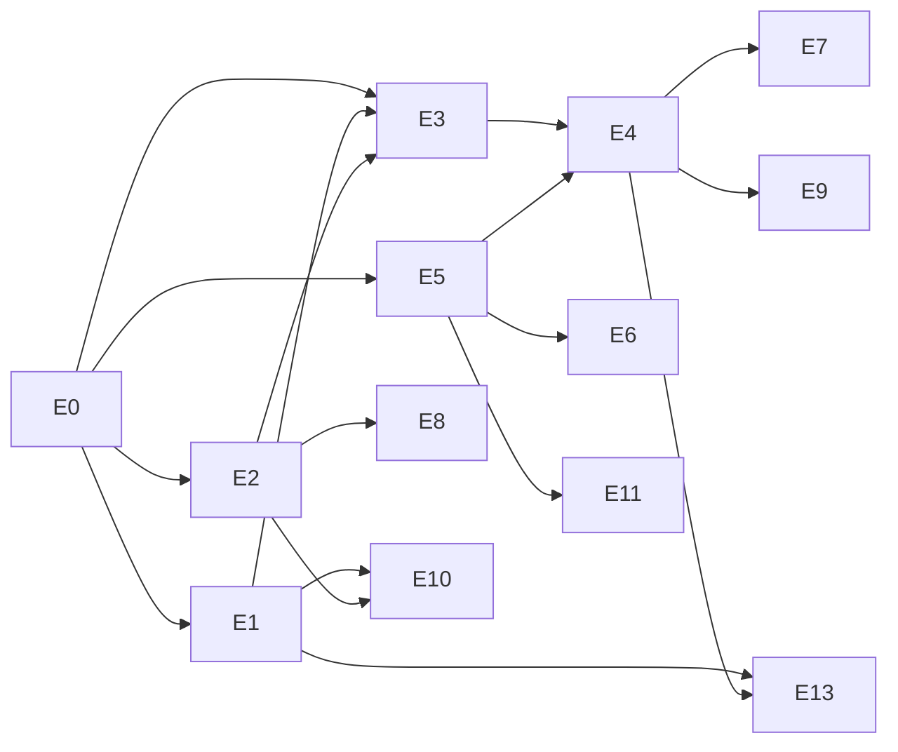

# Parish intake project backlog and coordination guide

This is the roadmap for the parish intake plugin. **GitHub Issues are the source of truth for work.** This document explains the phases, the epics and the rules for working on them. The September 2026 review that led to this version is in [reviews/2026-09-initial-plan-review.md](reviews/2026-09-initial-plan-review.md).

Background reading: [architecture](architecture.md), [data model](data-model.md), [hosting environment](hosting-environment.md), [testing](testing.md), [decisions](decisions/).

## Product goal

Parishes send their events the way they already communicate, starting with email to `events@adct.org.za`. The system extracts the events and emails the sender a preview with Approve / Deny / Edit. Approved events appear on a public events page on adct.org.za that can be filtered by **near me**, **type** and **date**, and in an ICS feed. It needs very little admin effort and runs on the existing xneelo shared host.

## Phases (vertical slices)

Each phase ends with something usable. Don't start a later phase's issues until the earlier phase's exit criteria are met, unless the issue is marked as a spike.

### Phase 0 – Foundations
Tooling and structure so everything after it is safe to build.
**Exit criteria:** CI runs unit and fixture tests on PHP 8.2–8.4. The domain core is separated from WordPress. The new schema is installed by migrations. The known date-parsing bugs are fixed with tests. A release zip is built by CI. Hosting unknowns are answered.

### Phase 1 – MVP email loop
**Exit criteria (the MVP demo):**
1. A parish secretary emails a notice with two events (one once-off, one "every first Friday") to the intake mailbox.
2. Within ~10 minutes she receives a confirmation email showing both events as they will appear.
3. She approves both. Because her address is a verified contact, they appear on the public events page (filterable by date, type, parish and near me) and in the ICS feed. The recurring event shows its upcoming dates.
4. An email from an unknown address lands in the admin review queue after the sender confirms. An admin links the address to a parish, and the next email from that address publishes directly.
5. The health dashboard shows when the mailbox was last checked, and any errors.

### Phase 1.5 – Posters and PDFs
Text from PDF attachments, manual entry beside an attachment preview, bulletin splitting quality.
**Exit criteria:** a PDF poster with a text layer produces a correct candidate. An image-only poster is shown beside the edit form for manual entry.

### Phase 2 – Self-service, monitoring and more inputs
Magic-link parish portal (edit, cancel, submit). Inactivity reminders with on/off switches. The archdiocese Google Calendar (ICS) and the monthly PDF as inputs. Optional AI/OCR plug-ins hardened.
**Exit criteria:** a parish contact logs in with a link, stays logged in, and edits or cancels their own event. Overdue parishes get reminders (when enabled). Archdiocesan Google Calendar events appear in the listing.

### Phase 3 – Secondary channels
Facebook Page connection, forwarded WhatsApp, websites/RSS, the "found on X, publish?" flow, and duplicate detection across sources.
**Exit criteria:** at least one monitored channel produces "found on X" emails, and approved items publish without duplicates.

## Epics

| Code | Epic | Phase(s) |
|---|---|---|
| E0 | Foundations: tooling, structure, packaging | 0 |
| E1 | Parish directory and sender registry | 1 |
| E2 | Email intake | 1 |
| E3 | Parsing pipeline | 1 |
| E4 | Submitter confirmation loop | 1 |
| E5 | Events model and publishing | 1 |
| E6 | Public events page and feeds | 1 |
| E7 | Admin review and operations | 1 |
| E8 | Posters, PDFs and attachments | 1.5 |
| E9 | Parish self-service portal | 2 |
| E10 | Monitoring and reminders | 2 |
| E11 | Calendar and document inputs | 2 |
| E12 | Optional AI and OCR plug-ins | 1 (fix), 2 |
| E13 | Secondary channels | 3 |

## Work items

Priority: **P0** = needed for the phase exit criteria, **P1** = should be in the phase, **P2** = nice to have or later. "Dep" lists the items that must be done first.
Phase 0, 1 and 1.5 items have GitHub issues. Phase 2 and 3 items are listed as checklists in their epic issues; turn them into issues when that phase starts.

### E0 – Foundations
| ID | Item | Pri | Dep | Acceptance (summary) |
|---|---|---|---|---|
| E0.1 | Hosting spike: cron, WP-CLI, SMTP limits, staging subdomain, outbound HTTPS | P0 | – | Answers recorded in `docs/hosting-environment.md`; staging site + test mailbox exist or are ticketed. |
| E0.2 | Composer, PHPUnit and GitHub Actions CI (PHP 8.2/8.3/8.4) | P0 | – | CI green on PRs; existing smoke test cases ported to PHPUnit with **equal or stronger** assertions. |
| E0.3 | Separate domain core from WordPress adapters | P0 | E0.2 | `src/Core` has no WordPress calls; ports defined; unit tests run without WordPress. |
| E0.4 | Parser fixture corpus and golden-test harness | P0 | E0.2 | `tests/fixtures/emails/*.eml` + expected JSON; readable diff; score report in CI; ≥10 anonymised real samples. |
| E0.5 | Fix date parsing: DD/MM, Africa/Johannesburg, dates without year, relative dates | P0 | E0.2 | `12/10/2026` → 12 October; "Sunday 5 October" resolves to the next matching date after the received date; "this Sunday" resolves correctly; tests added. |
| E0.6 | Versioned migrations and new schema | P0 | E0.3 | Tables from [data model](data-model.md) created and upgraded by version; activation/upgrade tested. |
| E0.7 | Scheduled job framework: lock, time budget, checkpoint, real cron | P0 | E0.3 | Jobs stop at the budget and resume; overlapping runs prevented; cron setup documented. |
| E0.8 | Release packaging: zip with bundled, namespace-prefixed dependencies | P0 | E0.2 | Tagging creates a GitHub Release with an installable zip; install/upgrade steps documented. |
| E0.9 | WordPress integration test harness and Playground preview blueprint | P1 | E0.2 | Integration tests run in CI; PRs can link to a Playground preview. |
| E0.10 | Roles and capabilities | P1 | E0.6 | Capabilities from ADR 0007 registered; screens check them; tests. |
| E0.11 | Secrets via `wp-config.php` constants | P1 | – | IMAP password/API keys read from constants when defined; settings UI shows "set in wp-config". |

### E1 – Parish directory and sender registry
| ID | Item | Pri | Dep | Acceptance |
|---|---|---|---|---|
| E1.1 | Parish admin screen and CSV import | P0 | E0.6 | Admins create/edit parishes (address, lat/lng, cadence, reminders flag); import ~150 parishes from CSV. |
| E1.2 | Contacts: several addresses per parish with trust states | P0 | E1.1 | Add/link/unlink/block addresses; one address can belong to several parishes. |
| E1.3 | Sender learning for unknown addresses | P1 | E1.2, E3.2 | Unknown sender creates a `pending` contact with a best-guess parish; one-click confirm. |
| E1.4 | Source registry: official vs monitored, status and health fields | P1 | E1.1 | Sources listed per parish with last checked/success and status. |
| E1.5 | Venues per parish | P1 | E1.1 | Parishes can have several venues with their own address/lat-lng; used by the parser. |

### E2 – Email intake
| ID | Item | Pri | Dep | Acceptance |
|---|---|---|---|---|
| E2.1 | IMAP client choice and `MailboxInterface` + IMAP adapter | P0 | E0.3 | Choice recorded as an ADR; adapter tested against GreenMail in CI. |
| E2.2 | Mailbox settings with a test-connection button | P0 | E2.1, E0.11 | Operators enter host/user; "Test connection" gives a clear success/error message. |
| E2.3 | Polling job: fetch, store raw + attachments, de-duplicate, move to Processed | P0 | E2.1, E0.7 | New mail stored once only (Message-ID + hash); checkpoint survives restarts; mail moved. |
| E2.4 | MIME to clean text: HTML, charsets, quoted replies, signatures, forwards | P0 | E0.3 | Fixture tests for Outlook/Gmail/forwarded/reply formats. |
| E2.5 | Auto-reply, bounce and list detection; capture SPF/DKIM results | P1 | E2.4 | Flagged messages never get confirmation emails; auth results stored and shown. |
| E2.6 | Ingest status, errors and reprocess button | P1 | E2.3 | Failed messages visible with error; one-click retry. |
| E2.7 | Retention and mailbox cleanup job | P1 | E2.3 | Raw data deleted after retention; Processed folder pruned; configurable. |

### E3 – Parsing pipeline
| ID | Item | Pri | Dep | Acceptance |
|---|---|---|---|---|
| E3.1 | Split messages into event blocks (bulletins) | P0 | E0.4 | A fixture bulletin with N events yields N candidates. |
| E3.2 | Lookup lists: parish/venue from directory and sender | P0 | E1.2 | Known sender fills parish and default venue; venue names matched from the directory. |
| E3.3 | Recurrence phrases to RRULE | P0 | E0.5 | Covers "every first Friday", "1st and 3rd Sunday", "every Tuesday and Thursday", "weekly/monthly", "until …", "during Lent" (flagged); tests per phrase. |
| E3.4 | Event type classification with editable keyword lists | P1 | E5.1 | Keywords map to `adct_event_type` terms; admins can edit lists. |
| E3.5 | Field and overall confidence scoring with review thresholds | P1 | E3.1 | Each field has a confidence; below-threshold items flagged in preview and queue. |
| E3.6 | Update, duplicate and cancellation matching | P1 | E5.3 | A re-sent or changed notice updates the existing event; "cancelled" notices mark it cancelled. |

### E4 – Submitter confirmation loop
| ID | Item | Pri | Dep | Acceptance |
|---|---|---|---|---|
| E4.1 | Action token service (hashed, single-use, expiry; GET shows page, POST acts) | P0 | E0.6 | Link scanners (GET) never change state; reused/expired tokens show a friendly message; tests. |
| E4.2 | Confirmation email with preview of each event | P0 | E4.1, E3.1 | HTML + plain text; one email per message covering all its events; contact details footer. |
| E4.3 | Approve/deny pages and routing by sender trust | P0 | E4.2, E1.2, E5.3 | Verified → publish; unknown → admin queue; approve-all and per-event; audit logged. |
| E4.4 | Staging mode: outbound email allow-list | P1 | E4.2 | When enabled, email only goes to listed addresses; banner in admin. |

### E5 – Events model and publishing
| ID | Item | Pri | Dep | Acceptance |
|---|---|---|---|---|
| E5.1 | `adct_event` post type, `adct_event_type` taxonomy and meta | P0 | E0.6 | Registered with default terms; editable in admin. |
| E5.2 | Occurrence expansion (RRULE, exceptions, 12-month window) | P0 | E5.1, E3.3 | Occurrences table correct for once-off and recurring events, in SAST (no daylight saving); tests. |
| E5.3 | Publish a candidate as an event (create/update; cancelled/postponed) | P0 | E5.1 | Approved candidate creates or updates the event and its occurrences. |
| E5.4 | Featured vs routine flag and admin event editing | P1 | E5.1 | Featured events highlighted in listings; admins edit all fields. |

### E6 – Public events page and feeds
| ID | Item | Pri | Dep | Acceptance |
|---|---|---|---|---|
| E6.1 | Events listing block/shortcode with date filter and paging | P0 | E5.2 | Upcoming occurrences grouped by date; works with the site theme; mobile friendly. |
| E6.2 | Type and parish filters | P1 | E6.1 | Filter by event type and parish; the URL reflects filters (shareable). |
| E6.3 | Near me: browser location or suburb, sorted by distance | P1 | E6.1, E1.1 | Asks permission; falls back to typing a suburb; shows distance. |
| E6.4 | Single event page | P1 | E5.1 | Details, recurrence in words, map link, contact, add-to-calendar. |
| E6.5 | ICS feed (all, per parish, per type) | P1 | E5.2 | Validates in Google/Apple/Outlook; recurring events use RRULE. |

### E7 – Admin review and operations
| ID | Item | Pri | Dep | Acceptance |
|---|---|---|---|---|
| E7.1 | Review queue with filters and bulk actions | P0 | E4.3 | Tabs: awaiting admin, low confidence, failed, unknown senders. |
| E7.2 | Candidate detail: source, attachments, fields; edit and approve | P0 | E7.1 | Side-by-side source and fields; save and approve in one step. |
| E7.3 | Audit log | P1 | E0.6 | Every decision recorded and viewable per item. |
| E7.4 | Health dashboard and failure alert emails | P1 | E2.3 | Last checked/success per source; queue sizes; alert after N consecutive failures. |
| E7.5 | Operator guide (`docs/operator-guide.md`) and in-screen help | P1 | E7.1 | A non-technical admin can follow it to review, approve and add a parish. |

### E8 – Posters, PDFs and attachments (Phase 1.5)
| ID | Item | Pri | Dep | Acceptance |
|---|---|---|---|---|
| E8.1 | PDF text extraction with size/page limits | P1 | E2.3 | Text-layer PDFs parsed; oversized files flagged, not crashed. |
| E8.2 | Manual entry beside attachment preview | P1 | E7.2 | Image/PDF shown next to the edit form in the admin area (and later the portal). |
| *Later* | Optional OCR provider (OCR.space / AI vision) · poster as featured image | P2 | E12 | |

### E9 – Parish self-service portal (Phase 2, checklist)
- Magic-link login and long sessions for `parish_contact` (ADR 0007)
- My events: list, edit, cancel, duplicate
- Submit a new event through a form
- Reply-with-changes handling (In-Reply-To → update candidate)
- Expiry and reminders for unanswered confirmations
- Admin: invite contacts, log out everywhere

### E10 – Monitoring and reminders (Phase 2, checklist)
- Track last received communication per parish and contact
- Overdue report against expected cadence
- Reminder emails with global and per-parish on/off, frequency limits
- Follow-up log and outcomes

### E11 – Calendar and document inputs (Phase 2, checklist)
- ICS source adapter (archdiocese Google Calendar) with UID-based sync
- Monthly PDF URL source (download, extract, parse into candidates for admin review)

### E12 – Optional AI and OCR plug-ins
- **Phase 1 issue – E12.1:** replace the `openrouter/auto` default (which is paid) with a generic OpenAI-compatible provider and a `:free` model default. Add a timeout, a daily cap and JSON schema validation. Treat email content as untrusted in the prompt. *(P1, Dep: E0.3)*
- Phase 2 checklist: OCR provider interface + OCR.space adapter; AI vision option; AI provenance shown in review; re-review rule for AI-filled fields; usage report.

### E13 – Secondary channels (Phase 3, checklist)
- Spike: WhatsApp forwarding and the Business Cloud API (ADR 0006)
- Spike: Facebook Page connection (Page token) vs alternatives
- Batch scheduler for secondary sources (N per run, oldest first)
- "Found on X, publish?" flow for monitored sources
- Website/RSS source adapter
- Cross-source duplicate detection

## Dependency overview

## GitHub Project setup

Create a GitHub Project for the repository with these fields:

| Field | Type | Values |
|---|---|---|
| Status | Single select | Backlog, Ready, In Progress, Blocked, Review, Done |
| Priority | Single select | P0, P1, P2, P3 |
| Phase | Single select | Phase 0, Phase 1, Phase 1.5, Phase 2, Phase 3 |
| Area | Single select | Data model, Ingestion, Parsing, Admin UI, Publishing, Notifications, Auth, Operations, Testing/CI |
| Depends on | Text | Issue numbers |
| Outcome type | Single select | Epic, Feature, Enhancement, Bug, Research, Operational task |

Labels mirror these fields (`phase-0`, `priority-P0`, `area-parsing`, `research`, `bug`…), so filtering works even without the Project board.

## Issue workflow

- Epics use the `Epic` template; implementation tasks use the `Work item` template.
- Every work item names its epic in "Related epic" and is added as a sub-issue of that epic.
- Acceptance criteria describe what a user sees or can do, and can be checked.
- Leave handoff notes in the issue before ending a session.
- When a phase starts, turn its epic checklist lines into work-item issues.

### Working model for contributors (people or agent sessions)
1. Pick one `Ready` issue whose dependencies are done.
2. Move it to `In Progress`.
3. Implement only that issue. Add or extend tests first, especially fixtures for parser changes.
4. **Never remove or weaken a test just to get a build passing** (see [testing](testing.md)).
5. Update the relevant doc in `/docs` if behaviour or design changes; add an ADR for new decisions.
6. Leave handoff notes, then move the issue to `Review` / `Done`.
7. Epics are for overview only. Don't rely on old chat history once issues exist.

## Prototype status (what exists today)

The prototype (PRs #1, #2) provides a manual parser screen, AI settings, a basic rule-based pipeline, a few recurrence phrasings and a static HTML report. These are **starting points, not finished features**. The single-row-per-message table is replaced by the new data model (E0.6), and the parser is refactored under E0.3–E0.5 and E3.
