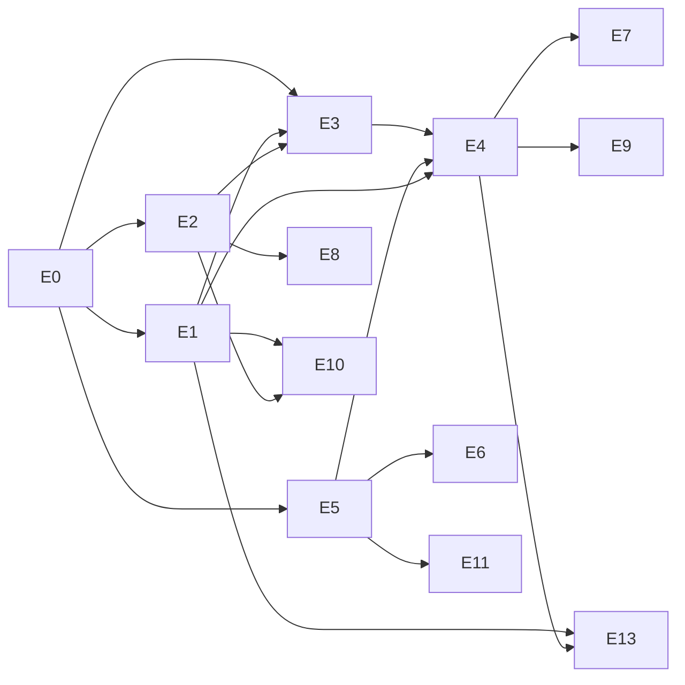

# Parish intake project backlog and coordination guide

This is the roadmap for the parish intake plugin. **GitHub Issues are the source of truth for work.** This document explains the phases, the epics and the rules for working on them. The September 2026 review that led to this version is in [reviews/2026-09-initial-plan-review.md](reviews/2026-09-initial-plan-review.md).

Background reading: [architecture](architecture.md), [data model](data-model.md), [hosting environment](hosting-environment.md), [testing](testing.md), [decisions](decisions/).

## Product goal

Parishes send their events the way they already communicate, starting with email to `events@adct.org.za`. The system extracts the events and emails the sender a preview with Confirm / Deny / Edit. After the sender confirms, the parish's **dean** or an **archdiocese reviewer** approves each new event ([ADR 0008](decisions/0008-approval-by-dean-or-archdiocese-reviewer.md)). Approved events appear on a public events page on adct.org.za that can be filtered by **near me**, **type** and **date**, and in an ICS feed. It needs very little admin effort and runs on the existing xneelo shared host, using the site's existing MySQL database.

## Phases (vertical slices)

Each phase ends with something usable. Don't start a later phase's issues until the earlier phase's exit criteria are met, unless the issue is marked as a spike.

### Phase 0 – Foundations
Tooling and structure so everything after it is safe to build.
**Exit criteria:** CI runs unit and fixture tests on PHP 8.2–8.4. Every PR gets a "Preview in WordPress Playground" button built from the CI zip. The domain core is separated from WordPress. The new schema is installed by migrations. The known date-parsing bugs are fixed with tests. Hosting unknowns are answered.

### Phase 1 – MVP email loop
**Exit criteria (the MVP demo):**
1. A parish secretary emails a notice with two events (one once-off, one "every first Friday") to the intake mailbox.
2. Within ~15 minutes she receives a confirmation email showing both events as they will appear. This assumes the free external pinger is set up; without it, it can take up to 2 hours ([ADR 0010](decisions/0010-scheduled-jobs-with-2-hour-cron-limit.md)).
3. She confirms both. The dean of her deanery and the archdiocese reviewers each get an approval email. The dean approves from the email. The reviewers' copy now shows "approved by the dean".
4. The events appear on the public events page (filterable by date, type, parish and near me) and in the ICS feed. The recurring event shows its upcoming dates.
5. She emails a time change for the once-off event. Because her address is a verified contact, it updates immediately, and the dean gets a change notice with a Revert link.
6. An email from an unknown address goes through the same confirm-then-approve steps. The approver sees an "unknown sender" warning and links the address to a parish.
7. The health dashboard shows when the mailbox was last checked, what triggered it, the mail queue size, and any errors.
8. Next week's bulletin from the same parish repeats the "every first Friday" event unchanged. No new confirmation or approval email is sent.
9. A parish in a deanery with no dean set up still gets its events approved, by an archdiocese reviewer.

Before launch, the release checklist runs once on a temporary xneelo staging instance ([ADR 0009](decisions/0009-preview-and-test-environments.md)). Launch then starts with a few pilot parishes.

### Phase 1.5 – Posters and PDFs
Text from PDF attachments, manual entry beside an attachment preview, bulletin splitting quality.
**Exit criteria:** a PDF poster with a text layer produces a correct candidate. A multi-column bulletin is read column by column. An image-only poster is either read by the optional OCR provider (when switched on) or shown beside the edit form for manual entry. Real samples showed about 1 in 4 posters are image-only ([parser findings](parser-samples.md)).

### Phase 2 – Self-service, monitoring and more inputs
Magic-link parish portal (edit, cancel, submit). Inactivity reminders with on/off switches. The archdiocese Google Calendar (ICS) and the monthly PDF as inputs. Optional AI/OCR plug-ins hardened.
**Exit criteria:** a parish contact logs in with a link, stays logged in, and edits or cancels their own event. Overdue parishes get reminders (when enabled). Archdiocesan Google Calendar events appear in the listing.

### Phase 3 – Secondary channels
Facebook Page connection, forwarded WhatsApp, websites/RSS, the "found on X, publish?" flow, and duplicate detection across sources.
**Exit criteria:** at least one monitored channel produces "found on X" emails, and items the parish accepts and an approver approves publish without duplicates.

## Epics

| Code | Epic | Phase(s) |
|---|---|---|
| [E0](https://github.com/Archdiocese-of-Cape-Town/adct.org.za/issues/3) | Foundations: tooling, structure, packaging | 0 |
| [E1](https://github.com/Archdiocese-of-Cape-Town/adct.org.za/issues/4) | Parish directory and sender registry | 1 |
| [E2](https://github.com/Archdiocese-of-Cape-Town/adct.org.za/issues/5) | Email intake | 1 |
| [E3](https://github.com/Archdiocese-of-Cape-Town/adct.org.za/issues/6) | Parsing pipeline | 1 |
| [E4](https://github.com/Archdiocese-of-Cape-Town/adct.org.za/issues/9) | Submitter confirmation and approval | 1 |
| [E5](https://github.com/Archdiocese-of-Cape-Town/adct.org.za/issues/7) | Events model and publishing | 1 |
| [E6](https://github.com/Archdiocese-of-Cape-Town/adct.org.za/issues/10) | Public events page and feeds | 1 |
| [E7](https://github.com/Archdiocese-of-Cape-Town/adct.org.za/issues/8) | Admin review and operations | 1 |
| [E8](https://github.com/Archdiocese-of-Cape-Town/adct.org.za/issues/11) | Posters, PDFs and attachments | 1.5 |
| [E9](https://github.com/Archdiocese-of-Cape-Town/adct.org.za/issues/13) | Parish self-service portal | 2 |
| [E10](https://github.com/Archdiocese-of-Cape-Town/adct.org.za/issues/12) | Monitoring and reminders | 2 |
| [E11](https://github.com/Archdiocese-of-Cape-Town/adct.org.za/issues/15) | Calendar and document inputs | 2 |
| [E12](https://github.com/Archdiocese-of-Cape-Town/adct.org.za/issues/14) | Optional AI and OCR plug-ins | 1 (fix), 2 |
| [E13](https://github.com/Archdiocese-of-Cape-Town/adct.org.za/issues/16) | Secondary channels | 3 |

## Work items

Priority: **P0** = needed for the phase exit criteria, **P1** = should be in the phase, **P2** = nice to have or later. "Dep" lists the items that must be done first.
Phase 0, 1 and 1.5 items have GitHub issues. Phase 2 and 3 items are listed as checklists in their epic issues; turn them into issues when that phase starts.

### E0 – Foundations ([E0](https://github.com/Archdiocese-of-Cape-Town/adct.org.za/issues/3))
| ID | Item | Pri | Dep | Acceptance (summary) |
|---|---|---|---|---|
| [E0.1](https://github.com/Archdiocese-of-Cape-Town/adct.org.za/issues/18) | Hosting spike: cron, WP-CLI, SMTP limits, temporary staging for the pre-launch check, outbound HTTPS | P0 | – | **Mostly answered:** cron every 2 h at most, no WP-CLI, 500 recipients/h per account, 30 MB, HTTPS OK, SPF/DKIM through authenticated SMTP (FluentSMTP) (ADR 0010/0011). Still open: loopback check, temporary staging. |
| [E0.2](https://github.com/Archdiocese-of-Cape-Town/adct.org.za/issues/17) | Composer, PHPUnit and GitHub Actions CI (PHP 8.2/8.3/8.4) | P0 | – | CI green on PRs; existing smoke test cases ported to PHPUnit with **equal or stronger** assertions. |
| [E0.3](https://github.com/Archdiocese-of-Cape-Town/adct.org.za/issues/20) | Separate domain core from WordPress adapters | P0 | E0.2 | `src/Core` has no WordPress calls; ports defined; unit tests run without WordPress. |
| [E0.4](https://github.com/Archdiocese-of-Cape-Town/adct.org.za/issues/19) | Parser fixture corpus and golden-test harness | P0 | E0.2 | `tests/fixtures/emails/*.eml` + expected JSON; readable diff; score report in CI; ≥10 anonymised real samples covering the types in [parser findings](parser-samples.md). |
| [E0.5](https://github.com/Archdiocese-of-Cape-Town/adct.org.za/issues/21) | Fix date parsing: DD/MM, Africa/Johannesburg, dates without year, relative dates | P0 | E0.2 | `12/10/2026` → 12 October; "Sunday 5 October" resolves to the next matching date after the received date; "this Sunday" resolves correctly; tests added. |
| [E0.6](https://github.com/Archdiocese-of-Cape-Town/adct.org.za/issues/22) | Versioned migrations and new schema | P0 | E0.3 | Tables from [data model](data-model.md) (including deaneries, approvers, approval fields and `event_changes`) created and upgraded by version; activation/upgrade tested. |
| [E0.7](https://github.com/Archdiocese-of-Cape-Town/adct.org.za/issues/23) | Scheduled job framework: lock, time budget, checkpoint, several triggers | P0 | E0.3 | Jobs stop at the budget and resume; overlapping runs prevented; works with WP-Cron traffic, a 2-hourly xneelo cron over HTTP, an optional external pinger and a "Check now" button (ADR 0010); setup documented without WP-CLI. |
| [E0.8](https://github.com/Archdiocese-of-Cape-Town/adct.org.za/issues/24) | Release packaging: zip with bundled, namespace-prefixed dependencies | P0 | E0.2 | CI builds an installable zip on every PR (used by previews and test sites); tagging creates a GitHub Release; install/upgrade steps documented. |
| [E0.9](https://github.com/Archdiocese-of-Cape-Town/adct.org.za/issues/27) | WordPress integration test harness and Playground PR preview button | P1 | E0.2, E0.8 | Integration tests run in CI; every PR gets a "Preview in WordPress Playground" button (official action, build + publish workflows) with sample data. |
| [E0.10](https://github.com/Archdiocese-of-Cape-Town/adct.org.za/issues/25) | Roles and capabilities | P1 | E0.6 | Capabilities from ADR 0007 registered, including the Deanery approver role; screens check them; tests. |
| [E0.11](https://github.com/Archdiocese-of-Cape-Town/adct.org.za/issues/26) | Secrets via `wp-config.php` constants | P1 | – | IMAP password/API keys read from constants when defined; settings UI shows "set in wp-config". |

### E1 – Parish directory and sender registry ([E1](https://github.com/Archdiocese-of-Cape-Town/adct.org.za/issues/4))
| ID | Item | Pri | Dep | Acceptance |
|---|---|---|---|---|
| [E1.1](https://github.com/Archdiocese-of-Cape-Town/adct.org.za/issues/30) | Parish admin screen and CSV import | P0 | E0.6 | Admins create/edit parishes (address, lat/lng, deanery, kind, parent parish, cadence, reminders flag); imports [`data/seed/parishes.csv`](../data/seed/README.md) (124 rows) and re-imports as updates. |
| [E1.2](https://github.com/Archdiocese-of-Cape-Town/adct.org.za/issues/28) | Contacts: several addresses per parish with trust states | P0 | E1.1 | Add/link/unlink/block addresses; one address can belong to several parishes. |
| [E1.3](https://github.com/Archdiocese-of-Cape-Town/adct.org.za/issues/31) | Sender learning for unknown addresses | P1 | E1.2, E3.2 | Unknown sender creates a `pending` contact with a best-guess parish; one-click confirm by an approver or admin. Being verified doesn't skip approval. |
| [E1.4](https://github.com/Archdiocese-of-Cape-Town/adct.org.za/issues/29) | Source registry: official vs monitored, status and health fields | P1 | E1.1 | Sources listed per parish with last checked/success and status. |
| [E1.5](https://github.com/Archdiocese-of-Cape-Town/adct.org.za/issues/33) | Venues per parish, outstations and mass centres | **P0** | E1.1 | Parishes can have several venues with their own address/lat-lng; outstations/mass centres linked to their parent parish; used by the parser (multi-church bulletins). |
| [E1.6](https://github.com/Archdiocese-of-Cape-Town/adct.org.za/issues/68) | Deaneries and approver assignment | P0 | E1.1, E0.10, E0.6 | 8 deaneries imported from [`data/seed/deaneries.csv`](../data/seed/README.md); one or more approvers per deanery (dean, assistant); **works with no approver set** (reviewers only; dashboard warning). |

### E2 – Email intake ([E2](https://github.com/Archdiocese-of-Cape-Town/adct.org.za/issues/5))
| ID | Item | Pri | Dep | Acceptance |
|---|---|---|---|---|
| [E2.1](https://github.com/Archdiocese-of-Cape-Town/adct.org.za/issues/35) | IMAP client choice and `MailboxInterface` + IMAP adapter | P0 | E0.3 | Choice recorded as an ADR; adapter tested against GreenMail in CI. |
| [E2.2](https://github.com/Archdiocese-of-Cape-Town/adct.org.za/issues/34) | Mailbox settings with a test-connection button | P0 | E2.1, E0.11 | Operators enter host/user; "Test connection" gives a clear success/error message. |
| [E2.3](https://github.com/Archdiocese-of-Cape-Town/adct.org.za/issues/32) | Polling job: fetch, store raw + attachments, de-duplicate, move to Processed | P0 | E2.1, E0.7 | New mail stored once only (Message-ID + hash); checkpoint survives restarts; mail moved. |
| [E2.4](https://github.com/Archdiocese-of-Cape-Town/adct.org.za/issues/37) | MIME to clean text: HTML, charsets, quoted replies, signatures, forwards | P0 | E0.3 | Fixture tests for Outlook/Gmail/forwarded/reply formats. |
| [E2.5](https://github.com/Archdiocese-of-Cape-Town/adct.org.za/issues/36) | Auto-reply, bounce and list detection; capture SPF/DKIM results | P1 | E2.4 | Flagged messages never get confirmation emails; auth results stored and shown. |
| [E2.6](https://github.com/Archdiocese-of-Cape-Town/adct.org.za/issues/39) | Ingest status, errors and reprocess button | P1 | E2.3 | Failed messages visible with error; one-click retry. |
| [E2.7](https://github.com/Archdiocese-of-Cape-Town/adct.org.za/issues/38) | Retention and mailbox cleanup job | P1 | E2.3 | Raw data deleted after retention; Processed folder pruned; configurable. |

### E3 – Parsing pipeline ([E3](https://github.com/Archdiocese-of-Cape-Town/adct.org.za/issues/6))
| ID | Item | Pri | Dep | Acceptance |
|---|---|---|---|---|
| [E3.1](https://github.com/Archdiocese-of-Cape-Town/adct.org.za/issues/40) | Split messages into event blocks (bulletins) | P0 | E0.4 | A fixture bulletin with N events yields N candidates. |
| [E3.2](https://github.com/Archdiocese-of-Cape-Town/adct.org.za/issues/41) | Lookup lists: parish/venue from directory and sender | P0 | E1.2 | Known sender fills parish and default venue; venue names matched from the directory. |
| [E3.3](https://github.com/Archdiocese-of-Cape-Town/adct.org.za/issues/42) | Recurrence phrases to RRULE | P0 | E0.5 | Covers "every first Friday", "1st and 3rd Sunday", "every Tuesday and Thursday", "weekly/monthly", "until …", "during Lent" (flagged); tests per phrase. |
| [E3.4](https://github.com/Archdiocese-of-Cape-Town/adct.org.za/issues/45) | Event type classification with editable keyword lists | P1 | E5.1 | Keywords map to `adct_event_type` terms; admins can edit lists. |
| [E3.5](https://github.com/Archdiocese-of-Cape-Town/adct.org.za/issues/43) | Field and overall confidence scoring with review thresholds | P1 | E3.1 | Each field has a confidence; below-threshold items flagged in preview and queue. |
| [E3.6](https://github.com/Archdiocese-of-Cape-Town/adct.org.za/issues/46) | Update, duplicate and cancellation matching | **P0** | E5.3 | Unchanged weekly repeats are matched silently (no emails); a changed notice updates the existing event; "cancelled" notices mark it cancelled. |
| [E3.7](https://github.com/Archdiocese-of-Cape-Town/adct.org.za/issues/74) | Skip non-event bulletin sections (Mass times, intentions, sick list, finances) | P0 | E3.1, E0.4 | Personal/routine sections produce no candidates and never reach event text or AI prompts; keyword lists editable. |

### E4 – Submitter confirmation and approval ([E4](https://github.com/Archdiocese-of-Cape-Town/adct.org.za/issues/9))
| ID | Item | Pri | Dep | Acceptance |
|---|---|---|---|---|
| [E4.1](https://github.com/Archdiocese-of-Cape-Town/adct.org.za/issues/44) | Action token service (hashed, single-use, expiry; GET shows page, POST acts) | P0 | E0.6 | Link scanners (GET) never change state; reused/expired tokens show a friendly message; tests. |
| [E4.2](https://github.com/Archdiocese-of-Cape-Town/adct.org.za/issues/47) | Confirmation email with preview of each event | P0 | E4.1, E3.1 | HTML + plain text; one email per message covering all its events; contact details footer. |
| [E4.3](https://github.com/Archdiocese-of-Cape-Town/adct.org.za/issues/50) | Confirm/deny pages and routing to approval | P0 | E4.2, E1.2, E5.3 | Confirmed → `awaiting_approval` in the dean and reviewer queues; submitter who is an approver → publish (self-approval); deny → rejected; confirm-all and per-event; audit logged. |
| [E4.4](https://github.com/Archdiocese-of-Cape-Town/adct.org.za/issues/48) | Test mode: outbound email allow-list | P1 | E4.2 | When enabled (test sites, pre-launch check), email only goes to listed addresses; banner in admin. |
| [E4.5](https://github.com/Archdiocese-of-Cape-Town/adct.org.za/issues/69) | Approver emails with Approve / Reject / Edit (per item or daily digest) | P0 | E4.1, E4.3, E1.6 | Dean and reviewers emailed in parallel; first to act wins (atomic); others see who acted; submitter told when live. |
| [E4.6](https://github.com/Archdiocese-of-Cape-Town/adct.org.za/issues/70) | Approval reminders with on/off switches | P1 | E4.5, E0.7 | One reminder after N days (default 3); global and per-approver off switch; never after a decision. |
| [E4.7](https://github.com/Archdiocese-of-Cape-Town/adct.org.za/issues/76) | Outbound email queue with hourly cap and priorities | P0 | E0.6, E0.7 | All plugin mail queued; cap default 100/h (host limit 500/h per account; delivery through the site-wide SMTP plugin); login links and confirmations first; retries; queue shown on health dashboard (ADR 0011). |

### E5 – Events model and publishing ([E5](https://github.com/Archdiocese-of-Cape-Town/adct.org.za/issues/7))
| ID | Item | Pri | Dep | Acceptance |
|---|---|---|---|---|
| [E5.1](https://github.com/Archdiocese-of-Cape-Town/adct.org.za/issues/49) | `adct_event` post type, `adct_event_type` taxonomy and meta | P0 | E0.6 | Registered with default terms; editable in admin. |
| [E5.2](https://github.com/Archdiocese-of-Cape-Town/adct.org.za/issues/51) | Occurrence expansion (RRULE, exceptions, 12-month window) | P0 | E5.1, E3.3 | Occurrences table correct for once-off and recurring events, in SAST (no daylight saving); tests. |
| [E5.3](https://github.com/Archdiocese-of-Cape-Town/adct.org.za/issues/52) | Publish a candidate as an event (create/update; cancelled/postponed) | P0 | E5.1 | Only approved candidates (or a verified contact's change) create or update the event and its occurrences; every change to a published event is written to `event_changes`. |
| [E5.4](https://github.com/Archdiocese-of-Cape-Town/adct.org.za/issues/53) | Featured vs routine flag and admin event editing | P1 | E5.1 | Featured events highlighted in listings; admins edit all fields. |
| [E5.5](https://github.com/Archdiocese-of-Cape-Town/adct.org.za/issues/71) | Instant changes by verified contacts, change notices and one-click revert | P1 | E5.3, E3.6, E4.5 | Verified contact's change/cancel publishes immediately; approvers get before/after notice with Revert/Unpublish; revert restores fields and occurrences. |

### E6 – Public events page and feeds ([E6](https://github.com/Archdiocese-of-Cape-Town/adct.org.za/issues/10))
| ID | Item | Pri | Dep | Acceptance |
|---|---|---|---|---|
| [E6.1](https://github.com/Archdiocese-of-Cape-Town/adct.org.za/issues/54) | Events listing block/shortcode with date filter and paging | P0 | E5.2 | Upcoming occurrences grouped by date; works with the site theme; mobile friendly. |
| [E6.2](https://github.com/Archdiocese-of-Cape-Town/adct.org.za/issues/56) | Type and parish filters | P1 | E6.1 | Filter by event type and parish; the URL reflects filters (shareable). |
| [E6.3](https://github.com/Archdiocese-of-Cape-Town/adct.org.za/issues/55) | Near me: browser location or suburb, sorted by distance | P1 | E6.1, E1.1 | Asks permission; falls back to typing a suburb; shows distance. |
| [E6.4](https://github.com/Archdiocese-of-Cape-Town/adct.org.za/issues/60) | Single event page | P1 | E5.1 | Details, recurrence in words, map link, contact, add-to-calendar. |
| [E6.5](https://github.com/Archdiocese-of-Cape-Town/adct.org.za/issues/57) | ICS feed (all, per parish, per type) | P1 | E5.2 | Validates in Google/Apple/Outlook; recurring events use RRULE. |

### E7 – Admin review and operations ([E7](https://github.com/Archdiocese-of-Cape-Town/adct.org.za/issues/8))
| ID | Item | Pri | Dep | Acceptance |
|---|---|---|---|---|
| [E7.1](https://github.com/Archdiocese-of-Cape-Town/adct.org.za/issues/59) | Review queue with filters and bulk actions | P0 | E4.3 | Tabs: awaiting approval (scoped to the user's deaneries for deanery approvers; all for reviewers), low confidence, failed, unknown senders, recent changes; shows who acted. |
| [E7.2](https://github.com/Archdiocese-of-Cape-Town/adct.org.za/issues/61) | Candidate detail: source, attachments, fields; edit and approve | P0 | E7.1 | Side-by-side source and fields; save and approve in one step. |
| [E7.3](https://github.com/Archdiocese-of-Cape-Town/adct.org.za/issues/58) | Audit log | P1 | E0.6 | Every decision recorded and viewable per item. |
| [E7.4](https://github.com/Archdiocese-of-Cape-Town/adct.org.za/issues/64) | Health dashboard, "Check now" button and failure alert emails | P1 | E2.3 | Last run and trigger per job; warning if nothing ran for 2 h 15 min; last checked/success per source; mail and parse queue sizes; deaneries without an approver; alert after N consecutive failures. |
| [E7.5](https://github.com/Archdiocese-of-Cape-Town/adct.org.za/issues/62) | Operator guide (`docs/operator-guide.md`) and in-screen help | P1 | E7.1 | A non-technical admin can follow it to review, approve and add a parish; a one-page guide for deans. |
| [E7.6](https://github.com/Archdiocese-of-Cape-Town/adct.org.za/issues/72) | Front-end approval queue for deans (magic-link login) | P2 | E7.1, E4.5, E1.6 | Dean logs in with an emailed link, sees only their deaneries' items and can act; in the MVP deans can act from emails alone. |

### E8 – Posters, PDFs and attachments (Phase 1.5) ([E8](https://github.com/Archdiocese-of-Cape-Town/adct.org.za/issues/11))
| ID | Item | Pri | Dep | Acceptance |
|---|---|---|---|---|
| [E8.1](https://github.com/Archdiocese-of-Cape-Town/adct.org.za/issues/65) | PDF text extraction with size/page limits, column-aware | P1 | E2.3 | Text-layer PDFs parsed; multi-column bulletins read column by column using text positions; oversized files flagged, not crashed. |
| [E8.2](https://github.com/Archdiocese-of-Cape-Town/adct.org.za/issues/63) | Manual entry beside attachment preview | P1 | E7.2 | Image/PDF shown next to the edit form in the admin area (and later the portal). |
| [E8.3](https://github.com/Archdiocese-of-Cape-Town/adct.org.za/issues/75) | Optional OCR for image-only posters (OCR.space / vision model) | P1 | E8.1, E8.2, E12.1 | Off by default; runs in the queue job with a timeout and daily cap; always falls back to manual entry. |
| *Later* | Poster as featured image | P2 | E8.2 | |

### E9 – Parish self-service portal (Phase 2, checklist) ([E9](https://github.com/Archdiocese-of-Cape-Town/adct.org.za/issues/13))
- Magic-link login and long sessions for `parish_contact` (ADR 0007)
- My events: list, edit, cancel, duplicate
- Submit a new event through a form
- Reply-with-changes handling (In-Reply-To → update candidate)
- Expiry and reminders for unanswered confirmations
- Admin: invite contacts, log out everywhere

### E10 – Monitoring and reminders (Phase 2, checklist) ([E10](https://github.com/Archdiocese-of-Cape-Town/adct.org.za/issues/12))
- Track last received communication per parish and contact
- Overdue report against expected cadence
- Reminder emails with global and per-parish on/off, frequency limits
- Follow-up log and outcomes

### E11 – Calendar and document inputs (Phase 2, checklist) ([E11](https://github.com/Archdiocese-of-Cape-Town/adct.org.za/issues/15))
- ICS source adapter (archdiocese Google Calendar) with UID-based sync
- Monthly PDF URL source (download, extract, parse into candidates for admin review)

### E12 – Optional AI and OCR plug-ins ([E12](https://github.com/Archdiocese-of-Cape-Town/adct.org.za/issues/14))
- **Phase 1 issue – [E12.1](https://github.com/Archdiocese-of-Cape-Town/adct.org.za/issues/66):** replace the `openrouter/auto` default (which is paid) with a generic OpenAI-compatible provider and a `:free` model default. Add a timeout, a daily cap and JSON schema validation. Treat email content as untrusted in the prompt. *(P1, Dep: E0.3)*
- Phase 2 checklist: (OCR provider moved to Phase 1.5 as [E8.3](https://github.com/Archdiocese-of-Cape-Town/adct.org.za/issues/75)); AI provenance shown in review; re-review rule for AI-filled fields; usage report.

### E13 – Secondary channels (Phase 3, checklist) ([E13](https://github.com/Archdiocese-of-Cape-Town/adct.org.za/issues/16))
- Spike: WhatsApp forwarding and the Business Cloud API (ADR 0006)
- Spike: Facebook Page connection (Page token) vs alternatives
- Batch scheduler for secondary sources (N per run, oldest first)
- "Found on X, publish?" flow for monitored sources (the parish's "yes" counts as confirmation; approval still follows)
- Website/RSS source adapter
- Cross-source duplicate detection

## Dependency overview

## Next steps

Phase 0, in this order:
1. **Archdiocese (no code needed):**
   - Hosting answers are in (see [hosting environment](hosting-environment.md)). Still open in [#18](https://github.com/Archdiocese-of-Cape-Town/adct.org.za/issues/18):
     - Does the WP-Cron loopback work (Site Health)?
     - Can a temporary staging instance be set up later?
   - Set up **FluentSMTP** on adct.org.za with xneelo's authenticated SMTP, and check SPF (`include:spf.host-h.net`) and DKIM in konsoleH. This helps all site email, not just this plugin.
   - Create a free cron-job.org account (or agree to use GitHub Actions) for the external pinger ([ADR 0010](decisions/0010-scheduled-jobs-with-2-hour-cron-limit.md)).
   - Real samples: 13 are in and reviewed ([parser findings](parser-samples.md)). Keep collecting, especially one-line email notices, forwarded emails and changes/cancellations ([#19](https://github.com/Archdiocese-of-Cape-Town/adct.org.za/issues/19)).
   - Deaneries and parishes are seeded ([`data/seed`](../data/seed/README.md)). When you are ready, give the deans' email addresses to set them up as approvers. Until then, reviewers approve everything ([#68](https://github.com/Archdiocese-of-Cape-Town/adct.org.za/issues/68)).
2. **Build** (see the [development guide](development.md#first-build-session) for the order and rules):
   - [#17](https://github.com/Archdiocese-of-Cape-Town/adct.org.za/issues/17) CI and PHPUnit
   - [#20](https://github.com/Archdiocese-of-Cape-Town/adct.org.za/issues/20) domain core split
   - [#21](https://github.com/Archdiocese-of-Cape-Town/adct.org.za/issues/21) date bug fix, test first
   - [#24](https://github.com/Archdiocese-of-Cape-Town/adct.org.za/issues/24) zip packaging
   - [#27](https://github.com/Archdiocese-of-Cape-Town/adct.org.za/issues/27) Playground PR preview button
3. **Then:**
   - [#22](https://github.com/Archdiocese-of-Cape-Town/adct.org.za/issues/22) migrations and schema (including the mail queue and parish kinds)
   - [#23](https://github.com/Archdiocese-of-Cape-Town/adct.org.za/issues/23) job framework with several triggers
   - [#25](https://github.com/Archdiocese-of-Cape-Town/adct.org.za/issues/25) roles, including Deanery approver
   - [#26](https://github.com/Archdiocese-of-Cape-Town/adct.org.za/issues/26) secrets

Once CI (#17) and previews (#27) are in place, every later PR has tests and a one-click preview.

## GitHub Project setup

Create a GitHub Project for the repository with these fields:

| Field | Type | Values |
|---|---|---|
| Status | Single select | Backlog, Ready, In Progress, Blocked, Review, Done |
| Priority | Single select | P0, P1, P2, P3 |
| Phase | Single select | Phase 0, Phase 1, Phase 1.5, Phase 2, Phase 3 |
| Area | Single select | Data model, Ingestion, Parsing, Admin UI, Publishing, Notifications, Auth, Operations, Testing/CI |
| Depends on | Text | Issue numbers |
| Outcome type | Single select | Epic, Feature, Enhancement, Bug, Research, Operational task |

Labels mirror these fields (`phase-0`, `priority-P0`, `area-parsing`, `research`, `bug`…), so filtering works even without the Project board.

## Issue workflow

- Epics use the `Epic` template; implementation tasks use the `Work item` template.
- Every work item names its epic in "Related epic" and is added as a sub-issue of that epic.
- Acceptance criteria describe what a user sees or can do, and can be checked.
- Leave handoff notes in the issue before ending a session.
- When a phase starts, turn its epic checklist lines into work-item issues.

### Working model for contributors (people or agent sessions)
1. Pick one `Ready` issue whose dependencies are done.
2. Move it to `In Progress`.
3. Implement only that issue. Add or extend tests first, especially fixtures for parser changes.
4. **Never remove or weaken a test just to get a build passing** (see [testing](testing.md)).
5. Update the relevant doc in `/docs` if behaviour or design changes; add an ADR for new decisions.
6. Leave handoff notes, then move the issue to `Review` / `Done`.
7. Epics are for overview only. Don't rely on old chat history once issues exist.

## Prototype status (what exists today)

The prototype (PRs #1, #2) provides a manual parser screen, AI settings, a basic rule-based pipeline, a few recurrence phrasings and a static HTML report. These are **starting points, not finished features**. The single-row-per-message table is replaced by the new data model (E0.6), and the parser is refactored under E0.3–E0.5 and E3.
